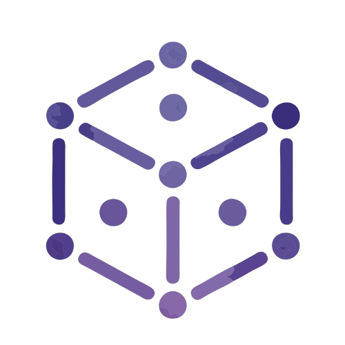

<!-- 

  

 -->

<h1 align="center">Thesius.ai</h1>

  We build LLM specific tools and platforms

## About us

Thesius.ai is an AI-first research and engineering platform focused on accelerating the way students, researchers, and developers discover, analyze, and utilize academic and technical knowledge.

## Our Core Projects

| Project | Description |
|---------|-------------|
| [**thesius.ai**](https://github.com/Thesius-ai/Thesius.ai) | Web based synthetic dataset generation application |
| [**thesius-deepresearch-cli**](https://github.com/Thesius-ai/thesius-deepresearch-cli) | Using deep research workflow to generate datasets for finetuning LLMs |
| [**thesius-localgen-cli**](https://github.com/Thesius-ai/thesius-localgen-cli) | synthetic dataset generation workflow using local file resources for finetuning LLMs |
| [**deepdoc**](https://github.com/Thesius-ai/deepdoc) | Terminal based deep research agent for report generation on local file resources |
| [**doc-sailor**](https://github.com/Thesius-ai/doc-sailor) | browser extension for automated navigation through technical web documentations |

## Links

- Website: https://thesius.ai *(Coming Soon)*
