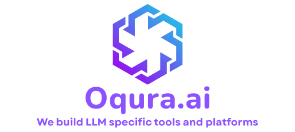

  

<!-- <h1 align="center">Oqura.ai</h1>

  We build LLM specific tools and platforms

 -->

## About us

Oqura.ai is an AI-first research and engineering platform focused on accelerating the way researchers, and developers use and build LLMs and LLM based applications.

## Our Core Projects

| Project | Description |
|---------|-------------|
| [**Oqura.ai**](https://github.com/Thesius-ai/Thesius.ai) | Web based synthetic dataset generation application |
| [**deepresearch-datagen-cli**](https://github.com/Thesius-ai/thesius-deepresearch-cli) | Using deep research workflow to generate datasets for finetuning LLMs |
| [**local-datagen-cli**](https://github.com/Thesius-ai/thesius-localgen-cli) | Synthetic dataset generation workflow using local file resources for finetuning LLMs |
| [**deepdoc**](https://github.com/Thesius-ai/deepdoc) | Terminal based deep research agent for report generation on local file resources |
| [**doc-sailor**](https://github.com/Thesius-ai/doc-sailor) | browser extension for automated navigation through technical web documentations |

## Disclaimer

Oqura is an open-source organization created with a focus on research and learning. We have no intention of infringing on any trademarks or intellectual property.
If any part of our work unintentionally overlaps with an existing trademark or right, please contact us at biswalswaraj88@gmail.com, and we’ll take immediate action to resolve it.
